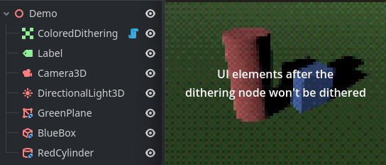

# Colored Dithering Shader Plugin for Godot

> ⭐ Thanks to markdibarry for making this cool shader.
> https://godotshaders.com/shader/arbitrary-color-reduction-ordered-dithering/

This is a minimal plugin that introduces a custom ColoredDithering node, to easily scaffold games with a colored dithering shader.

## Usage

Start by registering the plugin under *Project > Project Settings > Plugins*. Make sure **Enabled** is checked!

Add the ColoredDithering node to your scene. Control nodes in the scene placed before the ColoredDithering node will be subject to the shader effect.

For full shader parameter descriptions, see the shader description over at Godot Shaders linked above.

## Licensing

This project, like the original shader by **markdibarry**, is licensed under the [MIT license](LICENSE).
